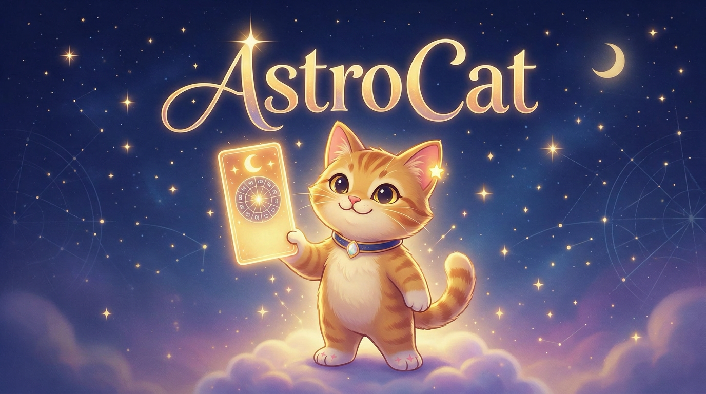

# AstroCat

**Your daily stars, delivered by a cat.**

AstroCat is a small, self-hosted horoscope app for a household or a group of friends. Every morning, Mira, a cat with a fondness for the night sky, writes each user a personal reading based on their own birth chart and today's planets: in English, Spanish or German, with paw ratings for love, work, energy and mood, and one concrete piece of advice.

It runs entirely on one computer at home (a Mac or a Linux machine such as a Raspberry Pi): a deterministic astrology engine decides *what* the day looks like, and a local language model ([Ollama](https://ollama.com)) only decides *how to say it*. Birth data never leaves the machine.



## Features

### Readings

- Personal daily reading from each user's birth chart (date, time and place of birth) and today's planetary transits, not just the Sun sign
- Works without a birth time too: falls back to noon and solar houses
- Headline, short summary, four categories with 1–5 paw ratings (love, work, energy, mood) and Mira's advice
- Look ahead: switch between today, tomorrow and the day after tomorrow
- "Why Mira says this": the day's strongest astrological influences in plain language ("Venus trine your Moon · supportive · 5th house: romance, play and creativity")
- English, Spanish and German, written directly in the language, with the form of address each user chooses (feminine, masculine or neutral forms)
- Quality checks on every generated reading (no jargon, no medical/financial advice, right language and weekday, no repetition across days), with automatic retries and a template fallback, so there is always a reading

### Mira

- Five illustrated moods, chosen by how the day looks: sleepy, cautious, calm, playful, radiant
- A consistent voice: warm, a little sassy, concrete, never preachy, exactly one cat pun a day

### App

- Mobile-first web app for phones; can be added to the home screen like an app
- Night-sky design with today's Moon phase, an occasional shooting star, and gentle animations (off with "reduce motion")
- Onboarding with an offline city search (≈ 171,000 places from GeoNames) and a manual fallback
- Invite-only: accounts by invite code in the app, or created by the admin

### Running it

- Readings for today, tomorrow and the day after are prepared in the background, in each user's timezone, and caught up automatically if the server was asleep or Ollama was down
- Everything local: no telemetry, no cloud services, no external API calls at runtime
- One `docker compose up` for the app, API and database; Ollama runs natively on the host

## How it works

```text
 Phone (browser / home-screen app)
            │  http://<server-ip>
            ▼
 ┌──────────── Docker on the server ─────────┐
 │  web  (Caddy: app + /api proxy)  :80      │
 │  api  (FastAPI: engine, readings, login,  │
 │        scheduler)                         │──► db (PostgreSQL)
 └──────────────┬────────────────────────────┘
                │ host.docker.internal:11434
                ▼
       Ollama on the host (gemma4:e4b)
```

1. The **engine** (Python, [`libephemeris`](https://github.com/g-battaglia/libephemeris)) computes the birth chart and today's transits, scores the four categories, picks the strongest influences and Mira's pose. Same input, same result.
2. The **LLM layer** turns that into a short brief and asks the local model for the reading in Mira's voice. It validates the answer and retries or falls back if needed.
3. The **api** stores one reading per user and day, generates missing ones in the background, and serves the app.

The full design, decisions and their reasons are in [concept.md](concept.md); development history and test logs in [TASKS.md](TASKS.md).

## Requirements

- **A computer that stays on** in your home network. Tested on macOS 26 with Apple silicon and 36 GB RAM, and on a Raspberry Pi 5 with 16 GB RAM (works, but slowly: see [Raspberry Pi and Linux](#raspberry-pi-and-linux)). The language model needs a few GB of free memory while it writes.
- **Docker:** [Docker Desktop](https://www.docker.com/products/docker-desktop/) on macOS, Docker Engine with the compose plugin on Linux
- **[Ollama](https://ollama.com)** with the model `gemma4:e4b` (about 9.6 GB download)
- Phones in the same Wi-Fi (any modern browser; iPhone and Android)
- About 12 GB of disk space (model, images, database)

## Setup

### 1. Install Ollama and the model

Install Ollama from [ollama.com](https://ollama.com) (on macOS also `brew install ollama`; on Linux `curl -fsSL https://ollama.com/install.sh | sh`), start it, then:

```sh
ollama pull gemma4:e4b
ollama run gemma4:e4b "Say hello in one sentence."   # quick check
```

### 2. Get the code and configure it

```sh
git clone git@github.com:mediaworkbench/astrocat.git
cd astrocat
cp .env.example .env
```

Edit `.env`. Only one value is required:

```sh
POSTGRES_PASSWORD=<a long random value>   # e.g. from: openssl rand -hex 24
```

Optional, but useful from the start:

```sh
REGISTRATION_CODE=<an invite code>        # lets people create accounts in the app; empty = off
```

All settings are listed under [Configuration](#configuration).

### 3. Start AstroCat

```sh
docker compose up -d --build
```

This builds and starts three containers: `web` (the app on port 80), `api` and `db`. Database migrations run automatically. Check that everything is up:

```sh
docker compose ps
curl http://localhost/api/health          # → {"status":"ok"}
```

### 4. Load the city list (once)

Onboarding needs the birth-place search. This downloads GeoNames' `cities1000` (≈ 10 MB) and takes about 20 seconds:

```sh
docker compose exec api astrocat places import
```

### 5. Create accounts

Either hand out the invite code from `.env` (people tap **Create account** in the app), or create accounts yourself:

```sh
docker compose exec api astrocat create-user anna --display-name Anna --language de
```

The command asks for a password. Usernames: 3–32 characters, lowercase letters, digits, dot, underscore or hyphen.

### 6. Open it on the phones

1. Find the server's IP address. macOS: **System Settings → Wi-Fi → Details**, or `ipconfig getifaddr en0`. Linux: `hostname -I`.
2. On a phone in the same Wi-Fi, open `http://<that-ip>/`.
3. Log in (or create an account) and complete onboarding: name, language, form of address, birth date and time, birth place.
4. Add it to the home screen:
   - **iPhone (Safari):** Share → **Add to Home Screen**. Log in once more inside the home-screen app; it keeps its own login.
   - **Android (Chrome):** menu → **Add to Home screen**.

The first reading takes a little longer (about 10–20 s) while Ollama loads the model. After that, readings are ready before you wake up.

### 7. Make it reliable

- **Fixed IP:** reserve the server's IP in your router (DHCP reservation), so the address on the phones keeps working.
- **Firewall:** if the phones can't connect, allow incoming connections on the app's port. macOS: allow Docker (System Settings → Network → Firewall → Options).
- **Start automatically:** on macOS, enable "Start Docker Desktop when you sign in" in Docker Desktop's settings and keep Ollama in your login items. On Linux, Docker and Ollama run as system services. The containers restart on their own.
- **Sleep:** the app is only reachable while the server is awake. On a laptop, keep it on power and prevent automatic sleep (System Settings → Battery/Energy). Missed readings are generated the next time someone opens the app.

### Raspberry Pi and Linux

The setup above works the same on Linux. A few differences:

- **Ollama:** install it with the official script (above). Containers reach it through `host.docker.internal`, which `compose.yaml` maps to the host, so it must listen on the network: `sudo systemctl edit ollama`, add `Environment="OLLAMA_HOST=0.0.0.0"` under `[Service]`, then `sudo systemctl restart ollama`.
- **Speed:** on a Raspberry Pi 5, `gemma4:e4b` needs about 2 minutes per reading. Set `OLLAMA_TIMEOUT=600` in `.env`, or the app falls back to the short template reading. `gemma4:e2b` is about twice as fast. Readings are prepared in the background, so the wait rarely shows.
- **Behind an existing web server:** if port 80 is taken (e.g. by nginx), bind the app to localhost with `WEB_PORT=127.0.0.1:8094` and forward a port or host name to it:

  ```nginx
  server {
      listen 8093;
      server_name astrocat.local;   # your server's name

      location / {
          proxy_pass http://127.0.0.1:8094;
          proxy_set_header Host $host;
          proxy_set_header X-Forwarded-For $proxy_add_x_forwarded_for;
          proxy_set_header X-Forwarded-Proto $scheme;
          proxy_read_timeout 300s;
      }
  }
  ```

## Everyday use

| Task | Command |
| --- | --- |
| Status | `docker compose ps` |
| Logs (incl. the scheduler) | `docker compose logs -f api` |
| Stop / start | `docker compose down` / `docker compose up -d` (data is kept) |
| Reset a forgotten password | `docker compose exec api astrocat reset-password <username>` |
| Create an account | `docker compose exec api astrocat create-user <username>` |
| Stop new sign-ups | empty or change `REGISTRATION_CODE` in `.env`, then `docker compose up -d api` |
| Update after `git pull` | `docker compose up -d --build` |

**Backups:** all data (accounts, birth data, readings, city list) lives in the `db` container's volume.

```sh
docker compose exec -T db pg_dump -U astrocat astrocat > astrocat-backup.sql      # back up
docker compose exec -T db psql -U astrocat -d astrocat < astrocat-backup.sql      # restore into an empty database
```

## Configuration

All settings live in `.env` (copied from [.env.example](.env.example)). After a change, run `docker compose up -d` (and `--build` for `SOURCE_URL`, which is baked into the app).

| Variable | Default | Meaning |
| --- | --- | --- |
| `POSTGRES_PASSWORD` | — (required) | Database password |
| `REGISTRATION_CODE` | empty | Invite code for **Create account** in the app; empty turns registration off |
| `WEB_PORT` | `80` | Port of the app on your network |
| `OLLAMA_BASE_URL` | empty | Where Ollama runs. Empty = on the same computer as AstroCat. Set it to use Ollama on another computer, e.g. `http://192.168.1.50:11434` (a bare host gets `http://` and port 11434 added) (that Ollama must listen on the network: `OLLAMA_HOST=0.0.0.0`) |
| `OLLAMA_MODEL` | `gemma4:e4b` | Model that writes the readings (`gemma4:e2b` is faster, but weaker in Spanish and German) |
| `OLLAMA_TIMEOUT` | `120` | Seconds to wait for the model (on a Raspberry Pi use about `600`) |
| `SESSION_DAYS` | `90` | Login lifetime; renewed automatically while the app is used |
| `COOKIE_SECURE` | `false` | Set to `true` once the app runs over HTTPS |
| `SCHEDULER_ENABLED` | `true` | Background generation of daily readings |
| `SCHEDULER_INTERVAL_MINUTES` | `15` | How often the scheduler looks for missing readings |
| `GENERATION_START` | `00:05` | Local time from which a user's new day is generated |
| `GENERATE_DAYS_AHEAD` | `2` | Also prepare tomorrow and the day after, so the app's day switch is instant; `0` = only today |
| `SOURCE_URL` | `https://github.com/mediaworkbench/astrocat` | Link to the source code, shown in the app's settings (AGPL); point it to your fork if you change the code |

Advanced (rarely needed): `LOGIN_MAX_FAILURES` (5) and `LOGIN_WINDOW_MINUTES` (15) for the login and invite-code rate limit, `WAIT_FOR_GENERATION_SECONDS` (90), `STALE_GENERATION_MINUTES` (5).

## Troubleshooting

| Problem | What to check |
| --- | --- |
| Phone can't open the app | Same Wi-Fi? Correct IP? Firewall (step 7)? `curl http://<server-ip>/api/health` from another computer |
| "Mira is reading the stars" takes very long | Is Ollama running (`ollama ps`)? The first reading after a restart loads the model. `docker compose logs api` shows each generation |
| Readings say Mira "was a little sleepy" (short template reading) | Ollama wasn't reachable or the model kept failing the checks; see `docker compose logs api`. From the container: `docker compose exec api python -c "import httpx; print(httpx.get('http://host.docker.internal:11434/api/version').text)"`. If that fails, let Ollama listen on all interfaces (`OLLAMA_HOST=0.0.0.0`: `launchctl setenv OLLAMA_HOST 0.0.0.0` on macOS, a systemd override on Linux) and restart Ollama. `timed out` in the log: raise `OLLAMA_TIMEOUT` |
| City search finds nothing | Run step 4 (`astrocat places import`) |
| "Create account" is missing | `REGISTRATION_CODE` is empty, or the `api` container wasn't restarted after setting it |
| Port 80 already in use | Set `WEB_PORT=8080` in `.env` and open `http://<server-ip>:8080/`, or put it behind your existing web server ([Raspberry Pi and Linux](#raspberry-pi-and-linux)) |

## Development

```sh
docker compose -f compose.yaml -f compose.dev.yaml up -d   # also publishes api :8000 and db :55432 on localhost
```

- **API and engine** (Python 3.12, [uv](https://docs.astral.sh/uv/)): see [api/README.md](api/README.md). Tests: `cd api && uv run pytest` (database tests use a separate `astrocat_test` database in the dev `db` container).
- **App** (Vite, React, TypeScript): `cd web && npm install && npm run dev` (hot reload on <http://localhost:5173>, `/api` proxied to :8000). Tests: `npm test`; all of Mira's poses side by side: <http://localhost:5173/#/poses>.
- **Reading quality:** `uv run astrocat review --profile demo/anna.yaml --days 14` renders two weeks of readings with the engine data as an HTML report; `--engine-only` skips the LLM for tuning the astrology.
- **Visual check:** `npm run screenshots` walks through the app at phone size (WebKit and Chromium via Playwright).
- **Tuning:** astrology settings in `api/src/astrocat/engine/data/`, Mira's prompt and the language packs in `api/src/astrocat/llm/data/`. Changing either regenerates readings automatically (the versions are part of the cache key).

## Privacy

- Birth data, accounts and readings stay in the local database.
- No telemetry, no analytics, no cloud APIs; fonts and images are bundled with the app.
- Nothing is downloaded at runtime; the city list is fetched once by the admin command in step 4.
- The app runs over plain HTTP inside your home network. Don't expose it to the internet as is.

## Credits and license

- Astrology calculations: [libephemeris](https://github.com/g-battaglia/libephemeris) (AGPL-3.0)
- City data: [GeoNames](https://www.geonames.org/) (CC BY 4.0)
- Readings: [Gemma 4](https://ollama.com/library/gemma4) via Ollama
- Fonts: Fraunces and Nunito (SIL Open Font License) via Fontsource

AstroCat is free software under the **GNU Affero General Public License v3.0** (see [LICENSE](LICENSE)), as required by `libephemeris`. Source: <https://github.com/mediaworkbench/astrocat>. If you run a modified version for other people, the AGPL requires offering them its source code; set `SOURCE_URL` so the app links to it.
