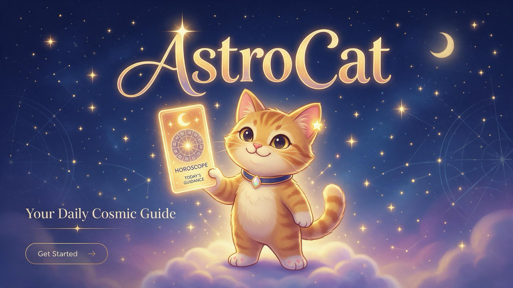

# AstroCat — Concept

> Status: MVP concept, v2 (2026-10-03)

**AstroCat** is a mobile-first daily horoscope PWA. Mira, a charming cat guide, presents each user's personal daily reading, calculated from their own birth chart and today's planetary transits. A deterministic astrology engine decides *what* the day looks like; a local LLM only decides *how to say it* — in Mira's voice, in English, Spanish, or German.

#### Taglines

- "Your daily stars, delivered by a cat."
- "Daily horoscopes with a little more magic."



---

## 1. Context and goals

#### Context

- Personal project, completely free, no monetization.
- Runs on a Mac at home; used by **3 users** on their phones via the **home Wi-Fi only**.
- May be published as an open-source project on GitHub later.

#### MVP goals

- Each user gets one personal reading per day, based on their birth data.
- Readings are available in **English, Spanish, and German** (per-user setting).
- Opening the app is instant (reading is pre-generated or cached).
- The cat feels like a real character with a consistent voice and visible moods.
- The astrology logic is deterministic and testable, independent of the LLM.

#### Non-goals for the MVP

- Push notifications, offline mode, HTTPS
- Public sign-up or hosting outside the home network
- Compatibility between users, weekly/monthly horoscopes, share cards
- Native apps

---

## 2. Product experience

#### Feel

- Cute but not childish; modern, clean, premium.
- Celestial visuals: stars, moons, soft gradients, subtle glow.
- The cat is a knowledgeable companion, not just a mascot.
- Personal, fun, and lightly magical rather than serious.

#### Layout

- Portrait, single column, designed for one-handed use. Mira sits at the top of the Today screen; content flows below.
- The key visual above is landscape and has text baked in. For the app we need portrait-friendly art **without text in images** (titles and labels are real text, so they can be translated and are accessible).

#### Screens

| Screen | Content |
|---|---|
| Login | Username + password. No sign-up link (invite-only). |
| Onboarding | Display name, language, how Mira should address you (feminine / masculine / neutral forms; matters for Spanish and German), birth date, birth time (optional, "I don't know" checkbox), birth place (city search), current timezone (prefilled from the browser). |
| Today | Mira in today's pose · headline · short summary · category cards with paw ratings · Mira's advice · expandable "Why Mira says this". |
| Settings | Language, form of address, birth data, timezone, change password, logout, "Source code" link (§12). |

**Loading state:** if a reading is not ready yet, Mira is shown "reading the stars" (small animation) while it is generated on demand.

---

## 3. Mira, the cat

**Name:** Mira — a real star (Mira, in Cetus), easy to say in all three languages, and Spanish *"¡Mira!"* ("Look!") fits a cat holding up your horoscope card.

#### Personality

- Curious, warm, confident, a little sassy.
- Wise but never preachy; encouraging even on difficult days.
- Speaks directly to the user ("you"), informal register: *du* in German, *tú* in Spanish.
- Uses the grammatical gender the user chose (feminine / masculine); with "neutral" it rephrases instead of using gendered adjectives. The user's name is never sent to the LLM, so it cannot guess a gender from it.

#### Voice rules

- Short sentences. Concrete, everyday suggestions.
- At most one cat pun or cat reference per reading.
- Difficult days are framed as "be gentle / take your time", never as doom.
- **No jargon in the prose.** Planet and sign names are fine ("the Moon", "Venus", "Pisces"); aspect names, houses, orbs and terms like "natal" or "transit" are not. Technical detail lives only in the "Why Mira says this" section.
- **Refer to the day by its weekday** ("this Saturday"), using the date label from the payload — never work it out from the date.

#### Mira never

- predicts accidents, illness, death, or catastrophes
- gives medical, financial, or legal advice
- tells the user to end or start a relationship
- guilts or shames the user

**Example lines** (reference for the prompt; one per language)
- EN: "The Moon is purring in your favor today — say the kind thing you've been holding back."
- ES: "Hoy la Luna ronronea a tu favor: di eso amable que te has estado guardando."
- DE: "Der Mond schnurrt heute auf deiner Seite – sag das Nette, das du dir bisher verkniffen hast."

**Poses (visual)** — the engine's overall day score selects Mira's pose:

| Score | Pose | Description |
|---|---|---|
| 1 | sleepy | curled up on a cloud, one eye open |
| 2 | cautious | sitting, ears slightly back, tail wrapped |
| 3 | calm | sitting upright, gentle smile |
| 4 | playful | batting at a star |
| 5 | radiant | standing, glowing card held high (key visual) |

**Assets:** create a character sheet first so Mira stays consistent across all poses (generated art drifts easily). A light idle animation (Rive or Lottie) is a polish item, not MVP-critical.

---

## 4. Daily reading content

Each reading contains:

| Part | Source | Length |
|---|---|---|
| Headline | LLM | max ~60 characters |
| Summary | LLM | 2–3 sentences |
| Love, Work, Energy, Mood | text: LLM · paw rating (1–5): engine | 1–2 sentences each |
| Mira's advice | LLM | 1 sentence |
| "Why Mira says this" | engine + i18n templates (no LLM) | list of today's top factors, e.g. "Venus trine your natal Moon (5th house)" |
| Disclaimer | static i18n text | "For entertainment." |

"Health" from v1 is renamed **Energy** to avoid medical territory.

**Unknown birth time:** readings still work (see §5.2); the "Why" section shows a small hint that house-based details are approximate.

---

## 5. Astrology engine

The engine is pure Python, deterministic, and has no knowledge of the LLM. Given birth data and a date, it always produces the same JSON.

### 5.1 Settings (defaults)

| Setting | Value |
|---|---|
| Zodiac | Western, tropical |
| House system | Whole Sign (simple, robust at all latitudes) |
| Bodies | Sun, Moon, Mercury, Venus, Mars, Jupiter, Saturn, Uranus, Neptune, Pluto; Ascendant only if birth time is known |
| Aspects | conjunction, sextile, square, trine, opposition |
| Transit orbs (starting values) | Moon 3°, Sun/Mercury/Venus/Mars 2°, Jupiter/Saturn 1.5°, Uranus/Neptune/Pluto 1° |
| Ephemeris | `libephemeris` |

### 5.2 Inputs

- **Birth date and local clock time.** Converted to UTC with `zoneinfo` using the historical timezone of the birth place. An optional manual UTC offset override covers cases where historical tz data is wrong (mostly births before ~1970 in some regions).
- **Birth time unknown → noon fallback.** The chart is cast for 12:00 local time, there is no Ascendant, and houses fall back to **solar houses** (Whole Sign counted from the Sun sign). Aspects to the natal Moon get a lower weight, since its position is uncertain by up to ~7°.
- **Birth place.** Offline city search using the GeoNames `cities1000` dataset (`cities15000` would miss many small birth towns), matching alternate names too (Munich / München / Múnich) → latitude/longitude; `timezonefinder` → IANA timezone. No external geocoding API (privacy, offline-friendly). GeoNames is CC BY 4.0 → attribution required.
- **Today.** The transit chart is computed for **local noon of the target date** in the user's *current* timezone.

### 5.3 Daily computation

1. **Natal chart:** computed once per user and cached; recomputed only when birth data or the engine version changes.
2. **Transit chart** for the target date (local noon).
3. **Factors:** all transit-to-natal aspects within orb, plus the natal house each transiting planet is in, plus the Moon's sign and phase.
   - **Moon exception:** the Moon moves ~13° per day, so a noon snapshot misses many of its aspects. Moon aspects count if they become exact at any time during the local day (00:00–24:00).
4. **Weighting:** `weight = planet weight × aspect strength × orb tightness`.
   - The Moon gets a high weight — it moves ~13°/day and provides the day-to-day variety.
   - Slow planets (Jupiter–Pluto) are capped to **one background theme**, otherwise the same transit would dominate for weeks.
5. **Categories:** each aspect contributes to one or more categories via its planets and houses; a placement ("Venus in your 5th house") only via its house, otherwise e.g. Venus would push every love score up every day (starting mapping, to be tuned):

   | Category | Planets | Houses |
   |---|---|---|
   | Love | Venus, Moon | 5, 7 |
   | Work | Sun, Mercury, Saturn, Jupiter | 6, 10 |
   | Energy | Mars, Sun | 1, 6 |
   | Mood | Moon, Neptune | 4, 12 |

   Harmonious aspects (trine, sextile) raise a score, tense ones (square, opposition) lower it, and conjunctions follow the planet's nature. The background theme counts half. Each category is normalized to **1–5 paws** (smooth curve, tuned so that 1 and 5 paws are rare, ~7% each); the overall day score (→ Mira's pose) is the weighted average, rounded.
6. **Selection:** the top 3–5 factors are passed on, always including at least one Moon factor. If the Moon makes no aspect that day, the Moon's natal house serves as the Moon factor (it always exists).
7. **Empty categories:** a category without any factor gets a neutral score of 3 and keywords from the Moon's sign and house.

### 5.4 Interpretation keywords

Instead of writing a text for every planet × aspect × planet × category combination (hundreds of texts), the engine uses small **keyword tables**:
- per planet (e.g. Venus → affection, beauty, pleasure)
- per aspect nature (harmonious → ease, flow; tense → friction, growth through effort)
- per house (5 → romance, play, creativity)
- per sign (for the Moon's daily sign)

The engine selects keywords; the LLM combines them into prose. The tables live as versioned YAML files in the repo, in English, and are written by us (no copying from books or websites — important for the open-source release).

---

## 6. LLM layer

- **Runtime:** Ollama on the macOS host (outside Docker), reached from containers at `http://host.docker.internal:11434`.
- **Model:** `gemma4:e4b` (chosen in M2: `e2b` is fine for English but too weak in Spanish and German; `e4b` takes ~8 s per reading); base URL and model name are configurable via `.env`.
- **Role:** turns the engine JSON into prose. It never sees raw positions or degrees, and it never decides ratings or poses.

#### Prompt structure

- System prompt: Mira's persona and voice rules (§3), content rules, output length limits.
- Language block: target language, register (*du* / *tú*), **glossary** of planet and sign names for that language, 1–2 example readings in that language.
- User message: the LLM payload (§7.1).
- **Recent readings block:** the headlines and advice of the user's last 3 readings in the same language, with the instruction not to reuse their phrases or openings. Small models repeat themselves easily; this keeps day-to-day readings feeling fresh. (This comes from the database, not from the engine, so the engine stays deterministic.)

#### Output control

- Structured output via Ollama's `format` parameter with the JSON schema from §7.2.
- Moderate temperature (start at ~0.7) for variety without drift.
- **Validation:** schema, length limits, a forbidden-topics check, a basic language check, a **jargon check** (per-language list of unambiguous terms, e.g. trine / trígono / Trigon), and a **repetition check** (headline must not match one of the last 3).
- **Retries:** up to 2; then fall back to a **template reading**: prewritten sentences per category × score × language (4 × 5 × 3 = 60 short sentences). The keyword tables are English-only, so they can't be used for ES/DE fallback text directly.
- Every stored reading records model name, prompt version, and engine version.

#### Glossary example

The full glossary is used for the i18n templates of the "Why" section. The LLM only gets the planet and sign names, since it must not use the rest (§3).

| EN | ES | DE |
|---|---|---|
| Libra | Libra | Waage |
| trine | trígono | Trigon |
| square | cuadratura | Quadrat |
| natal Moon | Luna natal | Geburtsmond |
| house | casa | Haus |

#### Review tool

A CLI command renders a series of days as one HTML page for tuning and quality checks, e.g. `astrocat review --profile demo/anna.yaml --from 2026-10-01 --days 14 --lang de`. It reads birth data from a YAML file because the database only arrives in M3 (`--user <username>` can be added then). Days are generated in order, so the recent-readings block (above) is exercised too:

- one row per day: paw ratings, Mira's pose, top factors (engine) next to the generated reading (LLM)
- flags: validation failures, fallback readings, repeated phrases across days
- summary: distribution of scores and poses over the period (are the paws actually varied, or stuck at 3?)
- `--engine-only` skips the LLM for fast tuning of weights and orbs

**Risk:** a 2B model is weakest outside English. Spanish and German quality is tested early (milestone M2). If one language is not good enough, options are: a larger local model for that language only, or generating in English and translating in a second LLM call.

---

## 7. JSON contract

### 7.1 Engine → LLM

The engine produces a full output (positions, degrees, orbs, all factors), which is stored as `engine_json` and feeds the "Why" section. The LLM receives only a **reduced payload** without any degrees or orbs:

```json
{
  "contract_version": 1,
  "date": "2026-10-03",
  "weekday": "saturday",
  "date_label": "Samstag, 3. Oktober",
  "language": "de",
  "user": {
    "display_name": "Anna",
    "sun_sign": "libra",
    "birth_time_known": true,
    "grammatical_gender": "feminine"
  },
  "day": {
    "moon_sign": "pisces",
    "moon_phase": "waxing_gibbous",
    "overall_score": 4,
    "mira_pose": "playful"
  },
  "categories": {
    "love":   { "score": 5, "keywords": ["warmth", "easy connection"], "factor_ids": ["f1"] },
    "work":   { "score": 2, "keywords": ["friction", "patience with structures"], "factor_ids": ["f2"] },
    "energy": { "score": 4, "keywords": ["drive", "momentum"], "factor_ids": ["f3"] },
    "mood":   { "score": 4, "keywords": ["dreamy", "intuitive"], "factor_ids": ["f1", "f4"] }
  },
  "factors": [
    {
      "id": "f1",
      "transit": "venus", "aspect": "trine", "natal": "moon",
      "house": 5, "nature": "harmonious",
      "keywords": ["affection", "emotional ease", "romance"]
    },
    {
      "id": "f2",
      "transit": "saturn", "aspect": "square", "natal": "sun",
      "house": 10, "nature": "tense", "background": true,
      "keywords": ["responsibility", "slow progress", "structure"]
    },
    {
      "id": "f3",
      "transit": "mars", "aspect": "sextile", "natal": "sun",
      "house": 1, "nature": "harmonious",
      "keywords": ["initiative", "physical energy"]
    },
    {
      "id": "f4",
      "transit": "moon", "aspect": "conjunction", "natal": "neptune",
      "house": 12, "nature": "neutral",
      "keywords": ["imagination", "need for quiet"]
    }
  ]
}
```

### 7.2 LLM → API

```json
{
  "headline": "string, max 60 chars",
  "summary": "string, 2–3 sentences",
  "sections": {
    "love": "string, 1–2 sentences",
    "work": "string, 1–2 sentences",
    "energy": "string, 1–2 sentences",
    "mood": "string, 1–2 sentences"
  },
  "advice": "string, 1 sentence"
}
```

Scores, Mira's pose, and the "Why" list come from the engine output, not from the LLM. `house` is the natal house the transiting planet is in. The overall score 4 is the rounded average of the category scores (3.75). `weekday` and `date_label` are added by the API (localized, e.g. with Babel), because small models often get the weekday of a date wrong; the engine itself stays language-independent.

---

## 8. Generation and caching

- **Cache key:** `(user_id, local_date, language, input_hash)`, where `input_hash` hashes the birth profile, the form of address, and `engine_version`. Editing birth data or the form of address therefore produces a new reading automatically, without separate invalidation logic. Each reading also stores `engine_version`, `prompt_version`, and the model name.
- **Scheduled job:** shortly after midnight (in each user's timezone), generate that day's reading. With 3 users this is 3 LLM calls per day.
- **On demand:** if a reading is missing (e.g. the Mac was asleep), it is generated when the user opens the app; Mira's loading animation covers the wait (expected: a few seconds).
- **No duplicates:** a unique constraint on the cache key plus a `generating` status. If two requests arrive at once, the second one waits for the first instead of starting another LLM call.
- **History:** past readings stay in the database (enables a history view later at no extra cost).

---

## 9. Users and authentication

- **Invite-only:** no public sign-up. Accounts are created with an admin command, e.g. `docker compose exec api astrocat create-user <username>`.
- Username + password; passwords hashed with **argon2**.
- Server-side sessions in Postgres, sent as an `HttpOnly`, `SameSite=Lax` cookie, long-lived (~90 days) so phones stay logged in.
- Users can change their own password in Settings; a forgotten password is reset with `astrocat reset-password <username>`.
- Basic login rate limiting.
- **iOS:** a home-screen app has its own cookie storage, separate from Safari. Users log in once *inside* the installed app.
- Because the MVP runs on plain HTTP in the home network, the cookie cannot use the `Secure` flag. This is acceptable on a trusted home Wi-Fi and is documented; it changes once HTTPS is added.

---

## 10. Architecture

```text
 Phone (browser / home-screen app)
            │  http://<mac-ip>
            ▼
 ┌──────────────────── Docker on the Mac ────────────────────┐
 │  web  (Caddy)  ── static PWA build                        │
 │        │  /api/*                                          │
 │        ▼                                                  │
 │  api  (FastAPI: auth, engine, LLM client, scheduler) ──► db (PostgreSQL)
 └────────┬──────────────────────────────────────────────────┘
          │ host.docker.internal:11434
          ▼
   Ollama on macOS (gemma4:e2b)
```

| Service | Contents |
|---|---|
| `web` | Caddy serving the static frontend build and reverse-proxying `/api` to `api`. Single entry point. |
| `api` | FastAPI app containing the astrology engine (`libephemeris`), LLM client, auth, and an in-process scheduler (APScheduler). |
| `db` | PostgreSQL: users, sessions, natal charts, daily readings. |
| Ollama | Runs natively on macOS, not in Docker. |

**Frontend:** Vite + React + TypeScript, with i18n (e.g. `react-i18next`) for UI strings in EN/ES/DE. Next.js is not needed: there is no server-side rendering requirement, and FastAPI already owns the backend.

**Dropped from v1:** separate `ephemeris` service (it's a library inside `api`), Redis (Postgres + in-process scheduler are enough at this scale).

### 10.1 Home network setup

- Give the Mac a **fixed LAN IP** (DHCP reservation in the router).
- Expose only `web` on port 80 (or 8080) to the LAN; allow it in the macOS firewall. `api` and `db` publish no ports and are reachable only inside the Docker network.
- The Mac must be awake for the app to be reachable. On-demand generation (§8) covers readings missed while it slept.

### 10.2 PWA without HTTPS

- The MVP runs over **plain HTTP** on the home network.
- Web app manifest + icons so users can add AstroCat to their home screen. iOS should open it in standalone mode (verify early in M4); on Android without HTTPS it behaves like a home-screen shortcut.
- No service worker in the MVP (browsers require HTTPS for it). Offline mode and push are out of scope anyway.
- **When HTTPS is needed later** (push, offline), without Tailscale:
  - **Caddy local CA:** Caddy issues certificates from its own CA; install and trust the root certificate once on each phone.
  - **Free DuckDNS subdomain + Let's Encrypt DNS-01** via Caddy: the subdomain points to the Mac's LAN IP. Some routers block DNS answers with private IPs (DNS rebinding protection) and need an exception for that domain.

---

## 11. Data model (sketch)

| Table | Key fields |
|---|---|
| `users` | id, username, password_hash, display_name, language, grammatical_gender (neutral / feminine / masculine), timezone, created_at |
| `birth_profiles` | user_id, birth_date, birth_time (nullable), place_name, latitude, longitude, birth_timezone, utc_offset_override (nullable) |
| `natal_charts` | user_id, engine_version, input_hash, chart_json, computed_at |
| `daily_readings` | user_id, local_date, language, input_hash, engine_json, reading_json, status (generating / ok / fallback / failed), model, prompt_version, engine_version, created_at |
| `sessions` | id, user_id, created_at, expires_at |

---

## 12. Open-source readiness

- All configuration and secrets in `.env`, with a `.env.example` in the repo.
- Birth data never leaves the local machine; no telemetry, no external APIs at runtime.
- Interpretation keywords and texts are our own.
- Seed/demo data uses fictional people only.
- Attribution for GeoNames (CC BY 4.0).
- **License: AGPL-3.0.** `libephemeris` is AGPL-3.0-only (checked 2026-10-03, v3.2.1), so AstroCat is released under AGPL-3.0 too. Because the app is used over a network, the AGPL requires offering its source to users: add a "Source code" link (to the GitHub repo) in Settings or the footer.

---

## 13. Milestones

The riskiest parts (engine plausibility, LLM quality in 3 languages) come first.

| # | Milestone | Done when |
|---|---|---|
| M1 | Engine as CLI | Birth data + date → engine JSON (§7.1); unit tests with known charts; noon fallback works; `review --engine-only` shows varied scores over 30 days. |
| M2 | LLM spike | Engine JSON → reading in EN/ES/DE; validation, retries, template fallback; a 14-day review (review tool, §6) per language passes a manual quality check: no jargon, correct weekdays, no obvious repetition. |
| M3 | API + DB + auth | Login, onboarding, `GET /api/today`, scheduler, admin `create-user`. |
| M4 | Frontend | Login, onboarding, Today, Settings; mobile layout; i18n; manifest. |
| M5 | Polish | Mira's character sheet and 5 poses, loading animation, celestial styling. |

---

## 14. Later

- HTTPS (§10.2), then push notifications ("Mira has your reading 🐾") and offline mode.
- History view of past readings.
- Lucky color / number of the day.
- Shareable story cards (9:16).
- Weekly overview.
- Compatibility between users.

---

## 15. Open questions

- Gemma 4 E2B quality in Spanish and German (answered by M2).
- Final orbs, weights, and category mapping (tuned after M1 with real charts).

---

## References

- libephemeris — <https://github.com/g-battaglia/libephemeris> · <https://pypi.org/project/libephemeris/>
- GeoNames — <https://www.geonames.org/>
